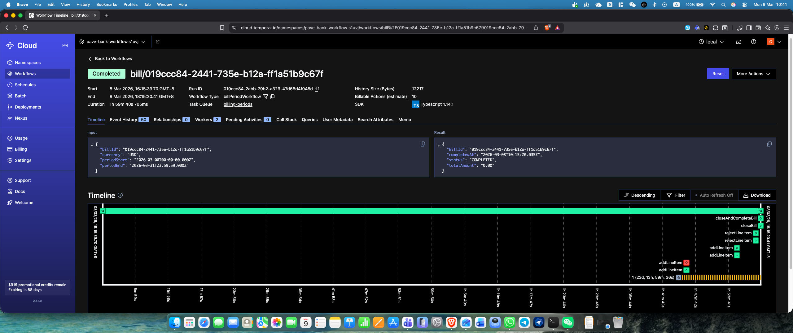
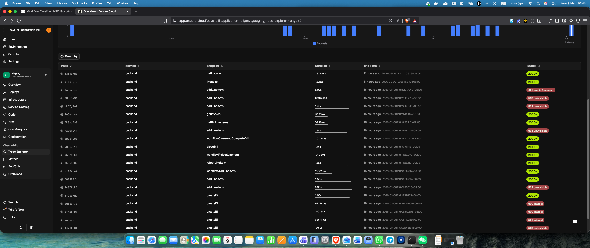

# Billing Backend (Encore)

This service is the public Encore API for bill management.

Architecture diagram:
- [diagrams.drawio.pdf](/Users/gareth/workspace/pave-bill-application/diagrams.drawio.pdf)
- Source: [diagrams.drawio](/Users/gareth/workspace/pave-bill-application/diagrams.drawio)

## Screenshots
Temporal Cloud workflow timeline for completed bill `019ccc84-2441-735e-b12a-ff1a51b9c67f`:



Encore Cloud trace explorer for the backend staging environment:



## Deployment Model
- Backend API runs on Encore Cloud.
- Temporal orchestration runs on Temporal Cloud.
- The Temporal worker runs outside Encore Cloud on AWS EC2 from the [`workflow/`](../workflow/README.md) package.
- The backend starts and updates Temporal workflows directly; it does not call the worker by URL.

## Requirement Alignment
- One Temporal workflow is started per bill: `bill/<billId>`.
- Workflow state transitions remain `OPEN -> CLOSED -> COMPLETED`.
- Add and reject mutations are accepted only while the bill is open.
- `closeBill` returns the charged total and charged line items at close time.
- Invoice reads are allowed only after completion and exclude rejected line items.
- Public POST endpoints remain idempotent through `Idempotency-Key`.
- Backend owns all SQL writes, idempotency records, and replay recovery logic.

## Assumptions
- Backend and worker share the same Temporal Cloud address, namespace, task queue, and API key.
- The external worker is allowed to call backend `/workflow/*` persistence endpoints over public HTTPS.
- `TEMPORAL_ADDRESS` and `TEMPORAL_NAMESPACE` are required configuration.
- `TEMPORAL_API_KEY` is configured as an Encore secret for Temporal Cloud.
- `TEMPORAL_TASK_QUEUE` defaults to `billing-periods` when not explicitly set.

## Features
- Create bills
- Start one Temporal workflow per bill period
- Add line items to open bills through Temporal updates
- Reject line items while bill is open through Temporal updates
- Close bills early through Temporal updates
- Read bill, line-item, and invoice state from Postgres
- List bills by status (`OPEN`, `CLOSED`, `COMPLETED`)
- Currency support: `USD`, `GEL`
- Idempotency support on POST endpoints via `Idempotency-Key`
- Recover `createBill` when the bill row exists but workflow start has not completed yet

## Prerequisites
- Encore CLI installed
- Docker running (required by `encore run` / `encore test`)

## Run locally
```bash
cd /Users/gareth/workspace/pave-bill-application/backend
export TEMPORAL_ADDRESS='localhost:7233'
export TEMPORAL_NAMESPACE='default'
encore run
```

Temporal configuration:
- `TEMPORAL_ADDRESS` is required.
- `TEMPORAL_NAMESPACE` is required.
- `TEMPORAL_TASK_QUEUE` defaults to `billing-periods`.
- `TEMPORAL_API_KEY` should be configured as an Encore secret for Temporal Cloud; when unset, the backend connects without API-key TLS.

Developer dashboard:
- http://localhost:9400

API base URL:
- http://127.0.0.1:4000

## Encore Cloud Setup
Required backend secrets/config in the Encore app environment:
- `TEMPORAL_ADDRESS=ap-southeast-1.aws.api.temporal.io:7233`
- `TEMPORAL_NAMESPACE=pave-bank-workflow.s1uvj`
- `TEMPORAL_TASK_QUEUE=billing-periods`
- `TEMPORAL_API_KEY=<Temporal Cloud API key>`

Operational notes:
- The backend now reads Temporal settings through Encore config/secrets instead of relying on plain `process.env` defaults in cloud.
- Missing Temporal config should fail fast instead of silently falling back to `localhost:7233` and `default`.
- The worker base URL is not configured here; backend talks to Temporal Cloud directly.

Health endpoints:
- `GET /livez`
- `GET /readyz`

## API Endpoints
- `GET /livez`
- `GET /readyz`
- `POST /bills`
- `POST /bills/:billId/line-items`
- `POST /bills/:billId/line-items/:lineItemId/reject`
- `POST /bills/:billId/close`
- `POST /bills/:billId/complete`
- `GET /bills/:billId`
- `GET /bills?status=OPEN|CLOSED|COMPLETED`
- `GET /bills/:billId/line-items`
- `GET /bills/:billId/invoice`

Notes:
- `status` is required on `GET /bills`.
- `POST /bills/:billId/close` returns the charged total and included line items for the close operation.
- Invoice retrieval is allowed only when the bill status is `COMPLETED`.
- Rejected line items are excluded from invoice totals.
- `POST /bills/:billId/complete` no longer performs completion. It only returns completion data if the workflow has already completed the bill; otherwise it returns `BillCompletionManagedByWorkflow`.
- `/workflow/*` persistence endpoints are intentionally public so the external Temporal worker can invoke them over HTTP from EC2.

### Accepted Risks
- The public `/workflow/*` endpoints let external callers bypass the intended public API flow and invoke workflow persistence operations directly.
- Idempotency still protects against duplicate requests within a scope, but it does not prevent a caller from submitting a new valid mutation through a workflow endpoint.
- A caller with bill identifiers can force add/reject/finalize operations outside the intended backend-to-workflow boundary.
- This tradeoff is accepted because the worker now runs outside Encore Cloud on EC2 and must reach backend persistence APIs over public HTTP.
- Post-completion mutations are rejected as business errors, but the backend still depends on Temporal workflow lifecycle state to distinguish a completed workflow from a live one.

### Example: Liveness
```bash
curl 'http://127.0.0.1:4000/livez'
```

### Example: Health
```bash
curl 'http://127.0.0.1:4000/readyz'
```

## Lifecycle
1. Create bill (`OPEN`)
2. Backend starts workflow `bill/<billId>`
3. Add / reject line items while the bill is `OPEN`
4. Close bill early through `POST /bills/:billId/close`, or let the workflow close it automatically at `periodEnd`
5. Workflow persists `OPEN -> CLOSED -> COMPLETED`
6. Invoice is available only after completion and excludes rejected items

### Example: Create bill
```bash
curl -X POST 'http://127.0.0.1:4000/bills' \
  -H 'Content-Type: application/json' \
  -H 'Idempotency-Key: create-bill-1111' \
  -d '{
    "currency": "USD",
    "periodStart": "2026-03-01T00:00:00Z",
    "periodEnd": "2026-03-31T23:59:59Z"
  }'
```

### Example: Add line item
```bash
curl -X POST 'http://127.0.0.1:4000/bills/<billId>/line-items' \
  -H 'Content-Type: application/json' \
  -H 'Idempotency-Key: add-line-item-1111' \
  -d '{
    "description": "Trading Fee",
    "amount": "25.50",
    "currency": "USD"
  }'
```

### Example: Reject line item
```bash
curl -X POST 'http://127.0.0.1:4000/bills/<billId>/line-items/<lineItemId>/reject' \
  -H 'Content-Type: application/json' \
  -H 'Idempotency-Key: reject-line-item-1111' \
  -d '{
    "reason": "Duplicate charge"
  }'
```

### Example: Close bill
```bash
curl -X POST 'http://127.0.0.1:4000/bills/<billId>/close' \
  -H 'Idempotency-Key: close-bill-1111'
```

### Example: Complete bill
```bash
curl -X POST 'http://127.0.0.1:4000/bills/<billId>/complete' \
  -H 'Idempotency-Key: complete-bill-1111'
```

Expected behavior:
- if the workflow has already completed the bill, this returns the completion payload
- otherwise it returns `BillCompletionManagedByWorkflow`

## Testing
Run backend unit tests:
```bash
cd /Users/gareth/workspace/pave-bill-application/backend
npm test
```

Run Encore-managed tests for the backend app:
```bash
cd /Users/gareth/workspace/pave-bill-application/backend
encore test
```

## Database access
```bash
cd /Users/gareth/workspace/pave-bill-application/backend
encore db shell backend
```

## Migrations
- `1_create_tables.up.sql`: base schema
- `2_add_idempotency_pending_state.up.sql`: backend-owned `PENDING` / `COMPLETED` idempotency state
- `3_add_bill_workflow_state.up.sql`: tracks whether a persisted bill has had its workflow started
